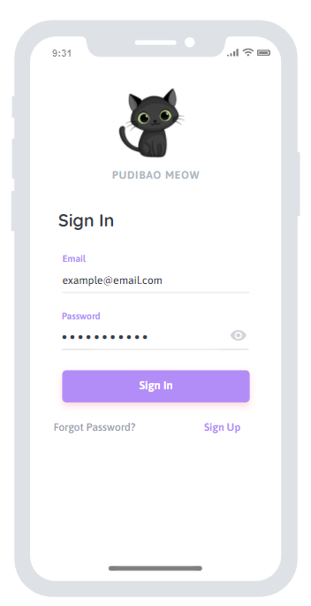
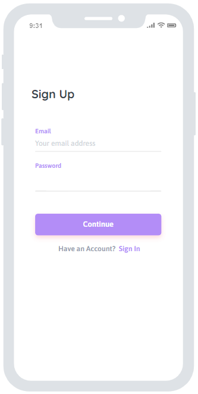
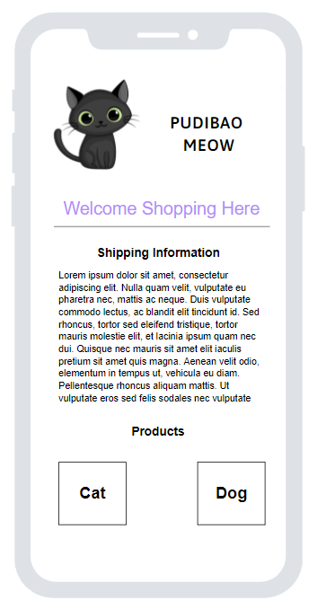
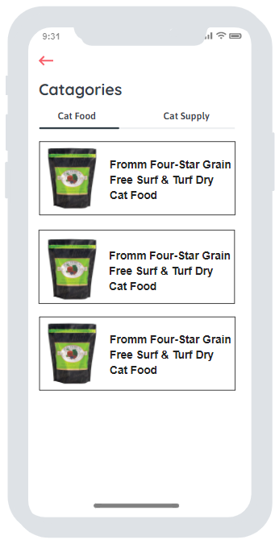
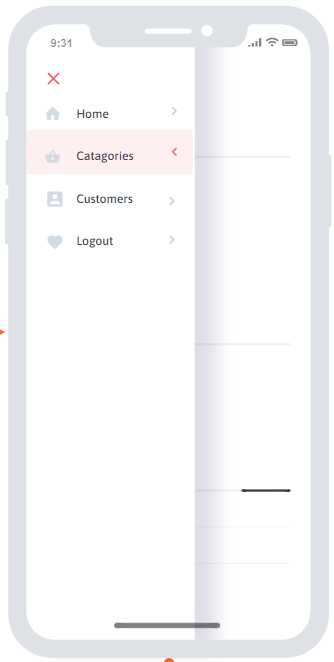

# PUDIBAO MEOW

## Platform Choice: React-Native & Firebase

## Dependences for installation
* npm install @expo/vector-icons
* npm install react-native-gesture-handler
* npm install @react-navigation/native
* npm install @react-navigation/drawer
* npm install @react-navigation/stack
* npm install react-native-safe-area-context
* npm install react-native-screens
* npm install react-native-reanimated
* npm install firebase

## Prototypes Images
* Login Screen

* Register Screen

* Home Screen

* Product Screen

* Navigation
