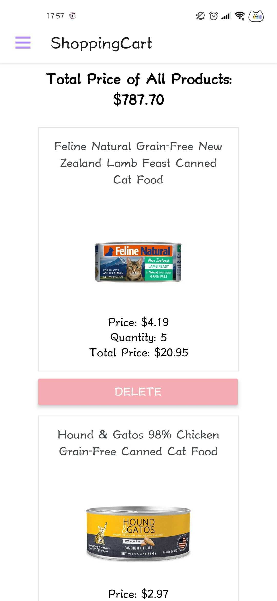

# PUDIBAO MEOW Pet Supply E-Commerce mobile application

## Platform Choice: React-Native & Firebase

## Dependences for installation
* npm install @expo/vector-icons
* npm/expo install react-native-gesture-handler
* npm/expo install @react-navigation/native
* npm/expo install @react-navigation/drawer
* npm/expo install @react-navigation/stack
* npm/expo install react-native-safe-area-context
* npm/expo install react-native-screens
* npm/expo install react-native-reanimated
* npm/expo install firebase
* npm/expo install @firebase/auth
* npm/expo install @firebase/firestore
* expo install react-native-keyboard-aware-scroll-view
* expo install react-native-elements
* expo install @react-navigation/bottom-tabs

## Config.js data
* the config.js file location is shown like following image

* data inside config.js will be sent to instructors (Phil and Alex) via Slack DM

## Milestone 1 (DONE)
* setting up user authentication via firebase
* store user data properly in firebase firestore
* create login and register page with authentication works

## Milestone 2 (DONE)
* set up home screen and put necessary information inside home screen
* set up side bar navigation for all needed screen to be navigate
* set up logout navigation and functionality

## Milestone 3 (DONE)
* build on product screen
* implement bottom tab functionality inside product screen to differentiate different kinds of products
* build on product detail screen which shows more information about the selected product

## Milestone 4 (DONE)
* set up wishlist screen stores the products a login user selected
* set up shopping cart screen stores the products a login user wants to buy
* added 'add to wishlist' and 'add to cart' button to product detail screen
* added a textInput capture the quantity a login user want to purchase in product detail screen

## Milestone 5 (PARTIALLY DONE)
* set up a search screen that allows users to search for a specific product (DONE)
* set up a SECURE payment screen allows users to pay for the cart products
* deploy this mobile application  (Heroku)

## Prototypes Images
* Login Screen

* Register Screen

* Home Screen

* Navigation

* Search Screen

* Product Screen

* Wishlist Screen

* Shopping Cart Screen

* Logout Screen
